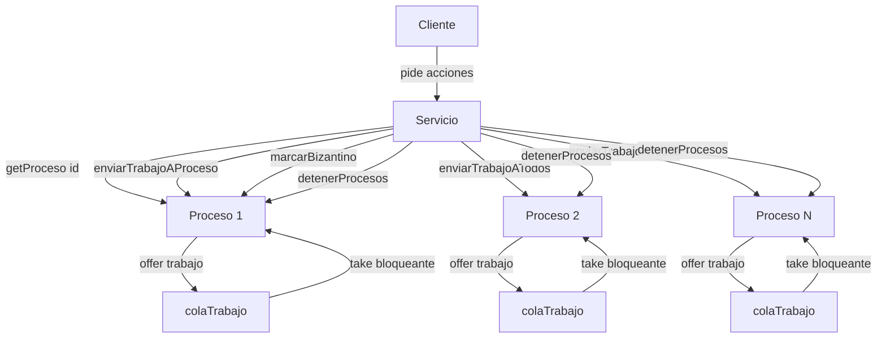

# Arquitectura del proyecto

## Visión general

El proyecto está organizado alrededor de tres clases principales:

- `Cliente`
- `Servicio`
- `Proceso`

La relación entre ellas es esta:

- `Cliente` representa al usuario o al punto desde el que se lanzan acciones.
- `Servicio` coordina los procesos locales de una máquina.
- `Proceso` representa un nodo lógico del sistema PBFT y, además, es un hilo (`Thread`).

## Esquema gráfico



## Papel de cada clase

### Cliente

Estado actual:

- La clase `Cliente` existe, pero todavía está vacía.

Papel previsto:

- lanzar propuestas
- consultar el estado del sistema
- activar o desactivar comportamiento bizantino en un proceso

La idea correcta es que `Cliente` no manipule directamente los atributos internos de `Proceso`. Debe hablar con `Servicio`, y `Servicio` ya delega en el proceso correspondiente.

## Servicio

`Servicio` es el gestor local de procesos. En una máquina real, esta clase representa la pieza que conoce todos los procesos alojados en esa máquina.

Métodos actuales en `Servicio`:

- `Servicio(int numeroProcesos)`
  Crea los procesos locales y los arranca con `start()`.

- `detenerProcesos()`
  Detiene todos los procesos gestionados por el servicio.

- `marcarBizantino(int id, boolean valor)`
  Cambia el estado bizantino de un proceso concreto.

- `enviarTrabajoAProceso(int id, String trabajo)`
  Envía una tarea a un proceso concreto.

- `enviarTrabajoATodos(String trabajo)`
  Envía la misma tarea a todos los procesos gestionados por el servicio.

- `getProcesos()`
  Devuelve la colección de procesos.

- `getProceso(int id)`
  Localiza un proceso por su identificador lógico.

## Proceso

`Proceso` es la clase que representa un nodo lógico del consenso. Además, como extiende de `Thread`, cada proceso tiene su propio hilo de ejecución.

### Atributos actuales de `Proceso`

- `idProceso`
  Identificador lógico del proceso dentro del sistema.

- `valorAceptado`
  Valor que ese proceso ha aceptado o decidido. Por ahora puede ser `null`.

- `bizantino`
  Indica si el proceso se comporta correctamente o no.

- `activo`
  Controla si el hilo debe seguir funcionando.

- `colaTrabajo`
  Cola bloqueante de tareas pendientes.

### Métodos actuales de `Proceso`

- `getIdProceso()`
- `getValorAceptado()`
- `esBizantino()`
- `setValorAceptado(Integer valorAceptado)`
- `setBizantino(boolean bizantino)`
- `agregarTrabajo(String trabajo)`
- `detenerProceso()`
- `run()`
- `toString()`

## Cómo se interrelacionan

### Relación Cliente -> Servicio

`Cliente` debe ser la puerta de entrada funcional del usuario. El usuario no debería ir proceso por proceso manualmente si puede pedirlo a `Servicio`.

Ejemplos futuros:

- el cliente propone un valor
- el cliente consulta estado
- el cliente marca un proceso como bizantino

### Relación Servicio -> Proceso

Esta es la relación principal del estado actual del proyecto.

`Servicio` hace tres cosas clave con `Proceso`:

1. Los crea.
2. Los arranca.
3. Les envía trabajo.

Ejemplo conceptual:

```java
servicio.enviarTrabajoAProceso(2, "propuesta:33");
```

Eso significa:

- `Servicio` localiza el proceso 2
- llama a `agregarTrabajo("propuesta:33")`
- el proceso 2 mete ese trabajo en su cola
- el hilo del proceso lo recogerá desde `run()`

### Relación Proceso -> colaTrabajo

Cada `Proceso` tiene su propia cola. No hay una cola global compartida por todos.

Eso significa que cada proceso recibe y procesa su trabajo de forma independiente.

## Para qué sirven las colas

La cola `colaTrabajo` es una bandeja de entrada de tareas para cada proceso.

### Idea simple

- `Servicio` mete trabajo en la cola.
- `Proceso` saca trabajo de la cola.

### Método que mete trabajo

```java
public void agregarTrabajo(String trabajo)
{
    this.colaTrabajo.offer(trabajo);
}
```

Qué hace `offer(...)`:

- intenta añadir un elemento a la cola
- en este proyecto, con `LinkedBlockingQueue`, normalmente lo añade sin problema

### Método que saca trabajo

En `run()`, el proceso usa:

```java
String trabajo = colaTrabajo.take();
```

Qué hace `take()`:

- si hay trabajo, lo saca y lo devuelve
- si no hay trabajo, el hilo se queda esperando bloqueado

### Por qué esto es importante

El enunciado dice que no debe haber espera ocupada.

Eso significa que un hilo no puede estar continuamente preguntando si ya llegó trabajo. Con `take()`, el proceso se queda dormido hasta que haya algo que procesar.

Eso evita consumo inútil de CPU.

## Flujo actual del sistema

El flujo actual, simplificado, es este:

```text
1. Se crea Servicio.
2. Servicio crea varios Proceso.
3. Servicio arranca esos Proceso con start().
4. Cada Proceso entra en run() y espera trabajo en colaTrabajo.
5. Servicio mete trabajo usando agregarTrabajo(...).
6. El Proceso saca ese trabajo con take() y lo procesa.
7. Si se llama a detenerProceso(), el hilo sale del bucle.
```

## Qué falta todavía

Ahora mismo las colas almacenan `String`, que solo sirve para arrancar el mecanismo.

Todavía falta:

- definir mensajes reales del protocolo
- distinguir entre propuesta, compromiso y comisión
- implementar el comportamiento PBFT en `Proceso`
- desarrollar `Cliente`
- adaptar `Servicio` para comunicación entre máquinas

## Resumen final

- `Cliente` será la interfaz de uso del sistema.
- `Servicio` gestiona los procesos de una máquina.
- `Proceso` es un hilo que representa un nodo lógico del consenso.
- cada `Proceso` tiene una `colaTrabajo` propia.
- `offer(...)` mete trabajo en la cola.
- `take()` saca trabajo de forma bloqueante.
- esta estructura permite trabajar sin espera ocupada y deja una base correcta para implementar PBFT después.